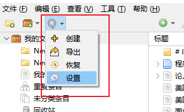
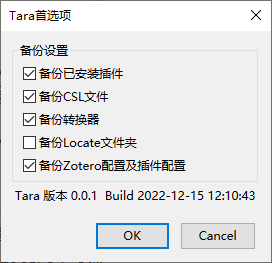

  <h1 align="center">Tara</h1>

# Tara(_Taraxacum_)蒲公英
[中文文档](./README_zh-CN.md)

Tara is a Zotero add-on for backup and restore preferences, add-ons, translators, styles. You can keep the same settings between different Zotero or restore history settings from the backup.

Backup includes:
+ Zotero preferences, include add-ons
+ Zotero installed add-ons
+ Zotero CSL styles
+ Zotero translators
+ Zotero locate，which is under Zotero directory

excludes：
1. Specific path in Zotero and add-ons
2. Zotero sync account information

# Usage

Download [xpi](https://github.com/l0o0/tara/releases) from release page.
After installation，function buttons are listed in Zotero toolbar

1. Create button will create backup attachment under Tara_Backup item in Zotero.
2. Export button will export backup attachment to Backup folder in Zotero data directory. You can install tara in another Zotero, and then click restore to select the exported attachment. 
3. Restore button can restore selected attachment you created before.

Preferences setting.

# ❤Thanks

This add-on is proud to use [Zotero addon template](https://github.com/windingwind/zotero-addon-template)